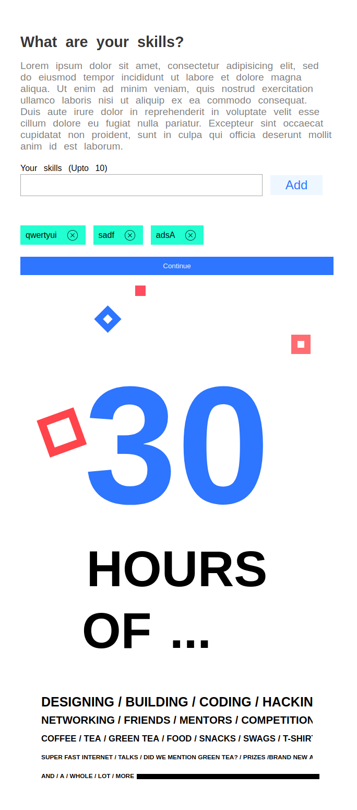

# Hack In Out Demp UI
## Made with Pure eact And Pure Css

## Have used create-react-app but have ejected it to supprt decorators

```
git clone https://github.com/nirajgeorgian/reactjs-hackinout-ui.git
cd reactjs-hackinout-ui
npm install
npm start
```

### User can type in a word in the given input field and press enter or click on the ‘Add’ Button. Following which, a tag element is added below the input field. A maximum of 10 tags are allowed. User can click on the ‘x’ button present on the tag to delete it.

### Addition to it one simple pure css frame using SVG 

